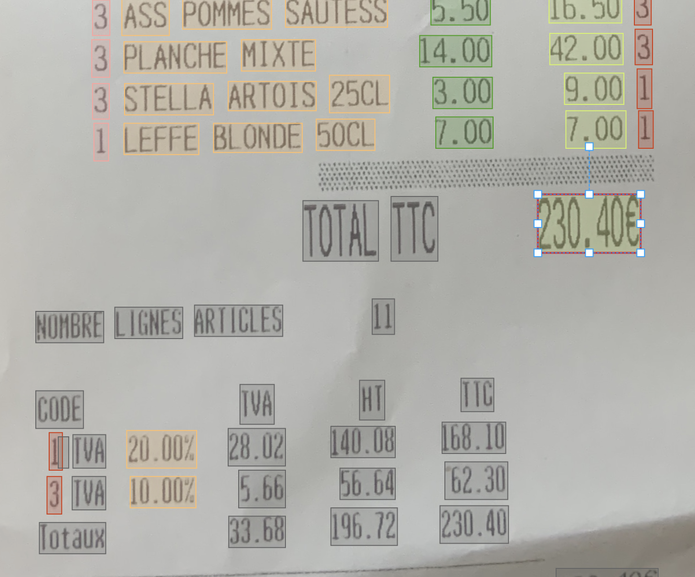
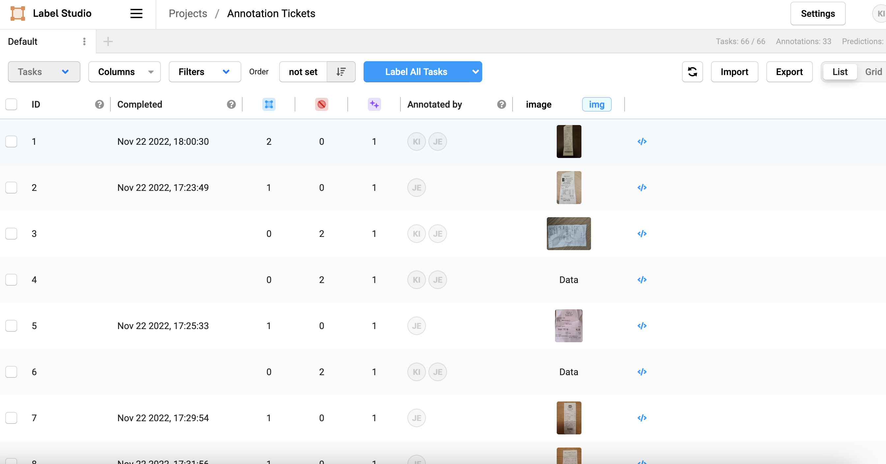

# Guide annotation tickets    
    
## Les labels: 
- date : la date (jour / mois / année) de l'achat, ne pas tagguer l'heure
- magasin: le nom de l'enseigne dont est issu le ticket de caisse (si le nom du magasin appart deux fois, il suffit de le tagguer une fois). Si le type de magasin apparait juste avant le nom ("restaurant Chez Raymond"), on taggue également le type.
- item_name: pour chaque ligne d'achat, le nom de l'item (si plusieurs boites, tagguer chacune des boites)
- item_unit_price: le prix à l'unité (si un seul article acheté, il sera confondu avec le item_total_price, lorsque c'est le cas et lorsqu'il n'y a qu'un seul prix affiché dans la ligne, mettre le tag "item_total_price")
- item_quantity : la quantité de l'item (peut être un entier ou un poids par exemple)
- item_total_price : le prix total de la ligne. 
- taux_tva : le taux de tva (pour chaque ligne, il arrive souvent que la tva soit indiquée via un code tva (voir tag ci-dessous))
- code_tva: lorsque le taux appliqué à une ligne est indiqué via un code, tagguer par code tva. Il y aura alors un tableau de correspondance, il faudra alors tagguer les éléments du tableau avec code_tva pour le code et taux_tva pour le taux. La reconcialiation ex-post des lignes (par un traitement codé en python) permettra de reconstituer le tableau
- total_price: le prix total TTC incluant le symbole de la monnaie si celui-ci apparait après le prix.

## Connexion et accès aux documents à annoter 

### Commencer à annoter 

Sur le service SSP Cloud, sélectionner "Tickets" parmi les projets. 

Vous arrivez alors sur un écran avec la liste des documents: 

Cliquer sur "Label All Tasks"

Vous arrivez alors sur le premier document à annoter. En cliquant sur "Label all tasks" (plutôt de cliquer sur un document parmi la listee des documents), Labelstudio vous dirige vers les documents qui n'ont pas encore été annotés par d'autres annotateurs. 

## Annoter les documents

- Sélectionner la box correspondant au "Magasin" 
- Pour attribuer le label "Magasin" à cette box, nous vous conseillons d'utiliser le raccourci clavier correspondant (le numéro correspondant à chaque label est donné en bas de l'écran), en cliquant sur 2 de votre clavier (sans activer la majuscule et sans utiliser le pavé numérique, soit la touche: &). Une autre possibilité est une fois la box sélectionnée, cliquer sur le label "Magasin" en bas de l'écran.
- Réitérer l'opération pour les autres box à labéliser 

Une fois que vous avez attribué tous les labels, cliquer sur le bouton "submit" à droite, ce qui enregistrera vos annotations et vous fera passer au prochain document à annoter. Pour avoir accès au bouton submit en haut à droite, il faut parfois remonter le menu déroulant qui liste l'ensemble des box du document. 

Remarques: 
- si l'élément que vous souhaitez annoter n'est pas encadré par une box, ne rien annoter du tout. 
- Si l'élément que vous souhaitez annoter est compris dans 2 boxes distinctes, annoter les 2 boxes avec le label correspondant
- Si l'élément que vous souhaitez annoter n'est que partiellement encadré par une box, l'annoter quand même: 

Autres remarques liées à la prise en main de l'outil: 
- il arrive de créer un box par erreur, dans ce cas la supprimer en sélectionnant la box ajoutée par erreur et en appuyant sur la touche "effacer" du clavier 
- si vous avez attribué le mauvais label à une box, il suffit de sélectionner la box et de sélectionner à nouveau le bon label (via les raccourcis clavier ou les options en bas de l'écran)
- si vous avez attribué un label à une box qui n'est pas censée avoir de label, vous pouvez cliquer sur le bouton "Undo" en forme de flèche retour à droite de l'écran. 

## Quelques précisions sur des cas particuliers 

- Quand la même info est présente plusieurs fois : on taggue seulement l'info la plus explicite (ex Total : xx euros) et il n'est pas nécessaire de mettre le tag lorsque l'information est présente une seconde fois.
- Lorsque l'info n'est pas bien capturée par la boite on ne la corrige pas
- Lorsque dans la même box, on a par exemple "2*1,67" (soit la quantité et le prix unitaire), on annote la box avec item_unit_price
